# Telco Customer Churn

This project looks at customer churn in a telecom dataset using Python and Pandas.

The goal is to work through the data step by step, starting with a raw data audit, then cleaning and preprocessing the data, exploring churn patterns, creating useful features, and finally comparing baseline machine learning models.

## Setup

Clone the repository and install the required packages:

```bash
git clone https://github.com/francisparwez/telco-customer-churn
cd telco-customer-churn
pip install -r requirements.txt
```

## Methodology

The project was completed in the following steps:

1. Loaded and audited the raw dataset.
2. Cleaned data type and missing value issues.
3. Split the data into training and test sets using stratification.
4. Built preprocessing for numerical and categorical features.
5. Explored churn patterns using EDA.
6. Created six new features related to tenure, spending, services, and contracts.
7. Trained Logistic Regression and Random Forest baseline models.
8. Used five-fold stratified cross-validation.
9. Evaluated the models using precision, recall, F1-score, and ROC-AUC.
10. Used the findings to make business recommendations.

## Current Progress

The raw data audit, cleaning/preprocessing, EDA, feature engineering, and baseline modeling stages are complete.

The audit checked for:

- Missing values
- Duplicate rows
- Data type issues
- Blank values
- Numerical outliers

One of the main issues found was that `TotalCharges` was stored as an object even though it contained numeric-looking values. Blank values were also found in this column.

The data was cleaned and prepared for machine learning by:

- Converting `TotalCharges` to numeric
- Handling the blank `TotalCharges` values
- Checking the cleaned data for missing values
- Removing `customerID` from the model features
- Separating `Churn` as the target
- Converting `Churn` to 0 and 1
- Splitting the data into training and test sets
- Using stratification to keep the churn proportions similar
- Imputing missing numerical and categorical values
- One-hot encoding categorical variables
- Scaling numerical variables
- Fitting the preprocessing steps on the training data only

The EDA stage looked at overall churn, tenure, charges, contract type, internet service, TechSupport, and the relationship between monthly charges and churn.

Feature engineering has also been completed. Six new features were created from the existing customer data:

- `tenure_group`
- `avg_monthly_spend`
- `service_count`
- `security_support_count`
- `streaming_services_count`
- `is_month_to_month`

These features were created to make tenure, spending, service usage, and contract type easier to use and compare in the later modelling stage.

## Dataset

The dataset contains customer information, account details, subscribed services, billing information, and the `Churn` target.

The main types of information include:

- Customer information such as gender, senior citizen status, partner, and dependents
- Account information such as tenure, contract type, payment method, and paperless billing
- Services such as phone service, internet service, online security, online backup, and tech support
- Billing information including monthly charges and total charges
- `Churn`, which is the target column for the classification models

The raw dataset is stored at:

```text
dataset/telco_customer_churn.csv
```

## Visuals

The main plots from the EDA are included below.

### Customer Churn

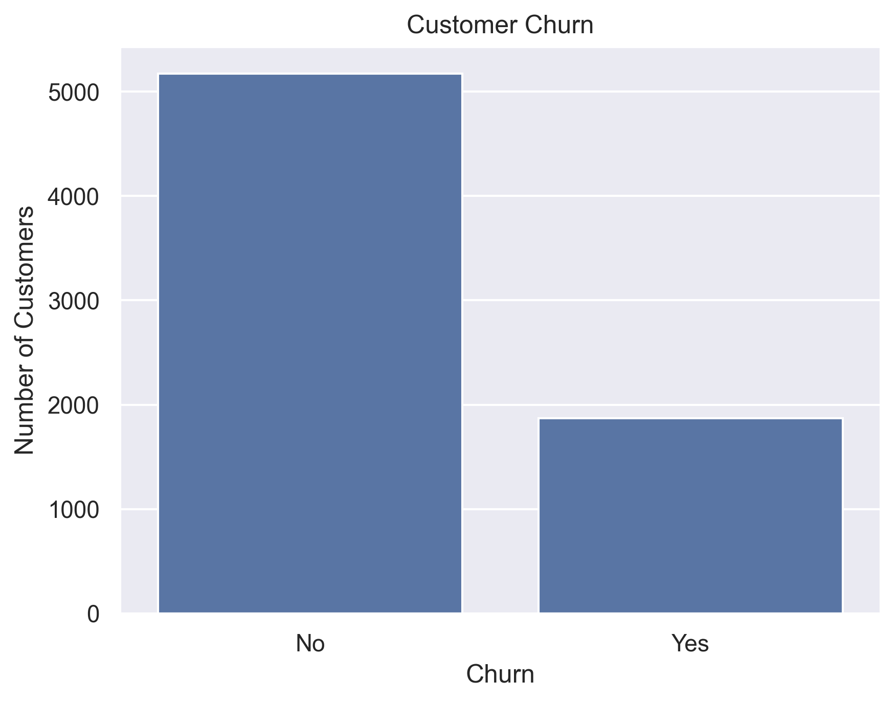

### Customer Tenure

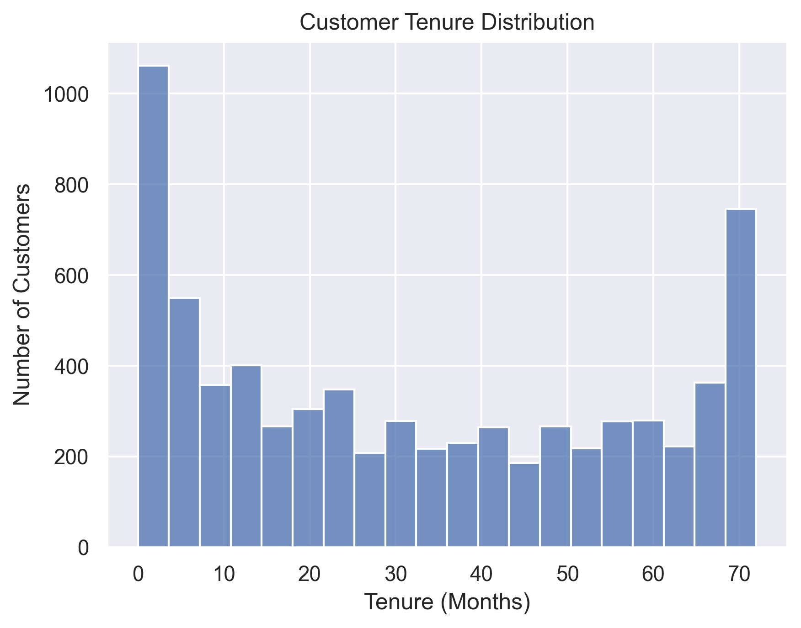

### Monthly Charges

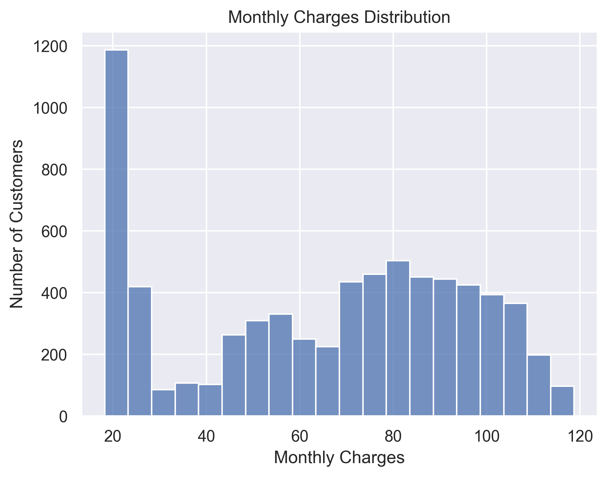

### Total Charges

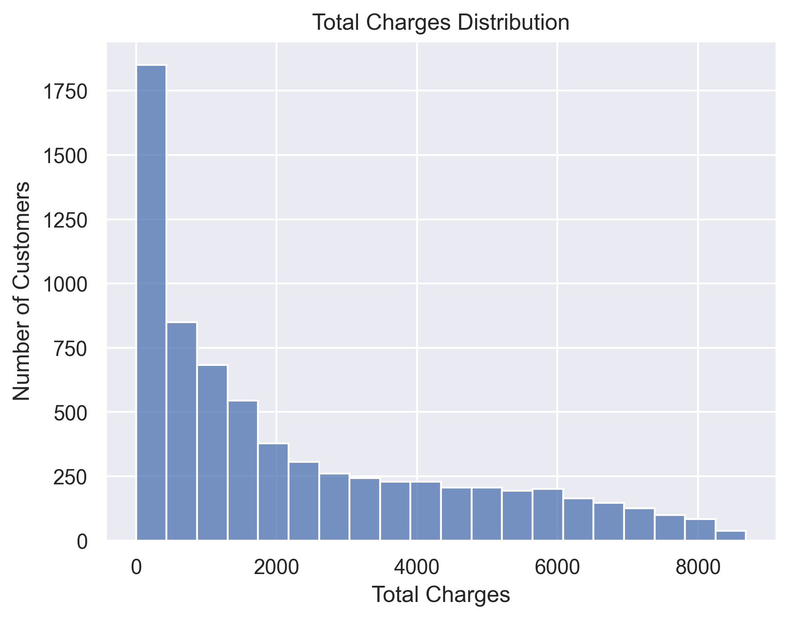

### Contract Type

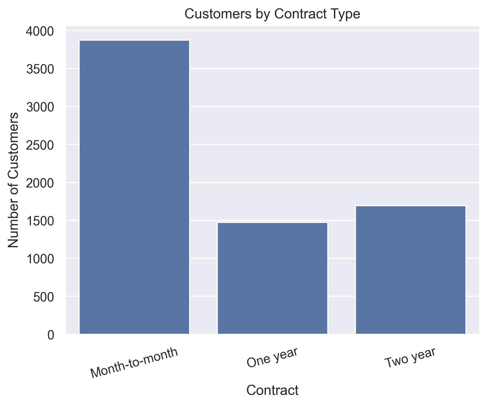

### Churn by Contract Type

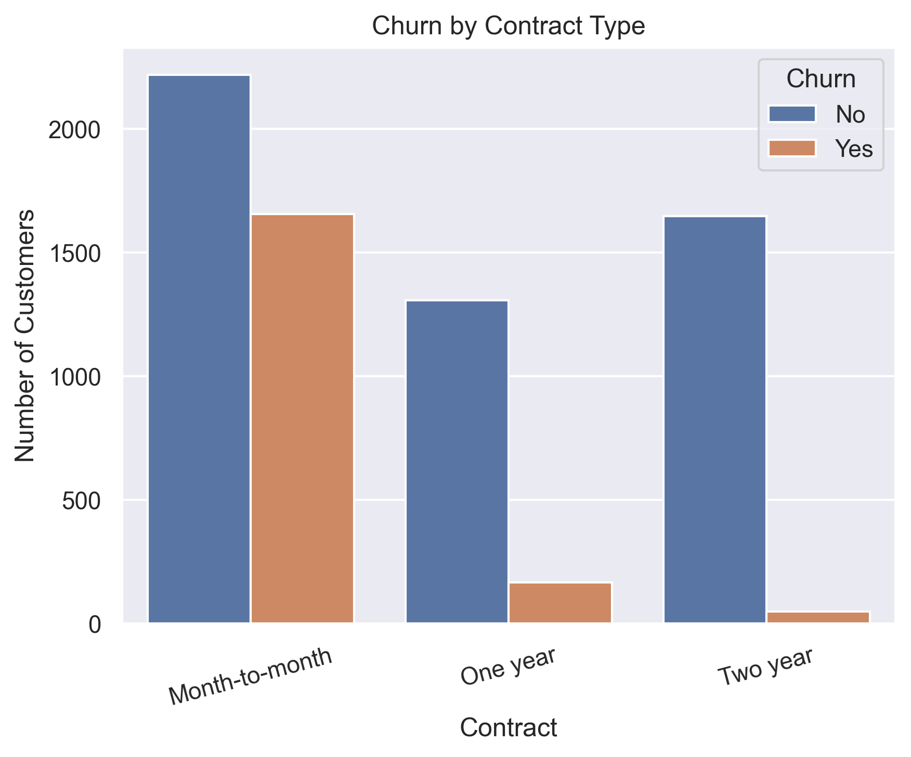

### Churn Rate by Contract Type

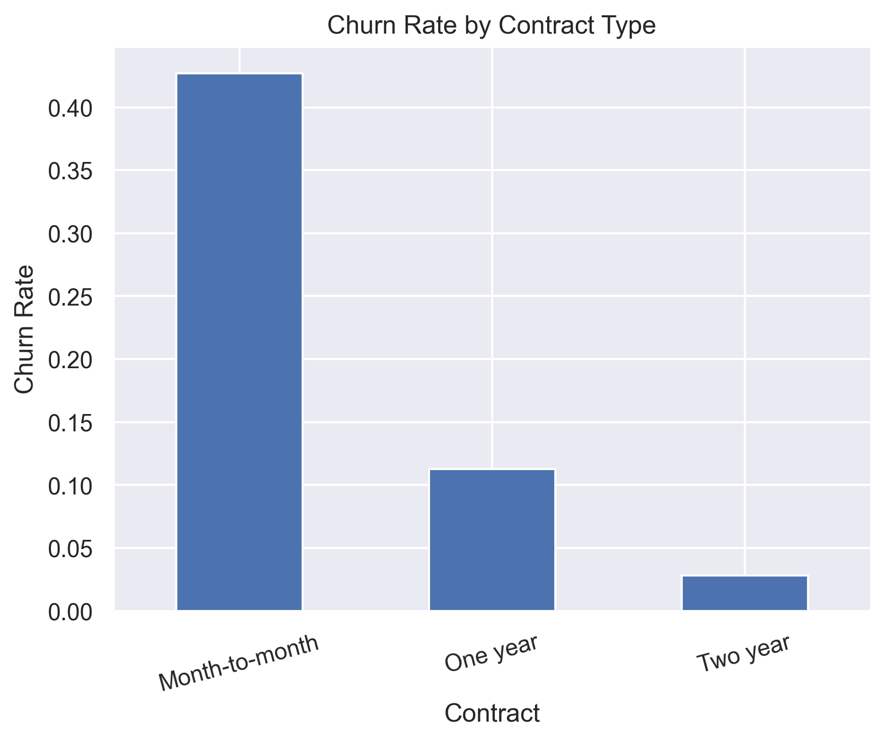

### Churn Rate by Tenure Group

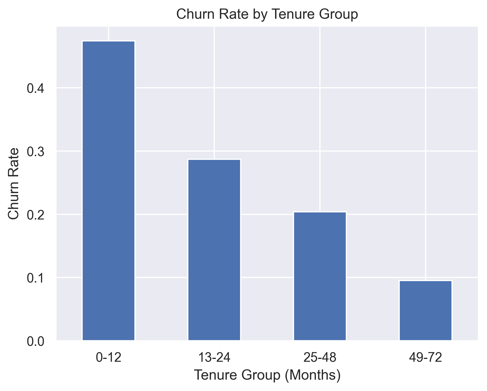

### Churn Rate by Internet Service

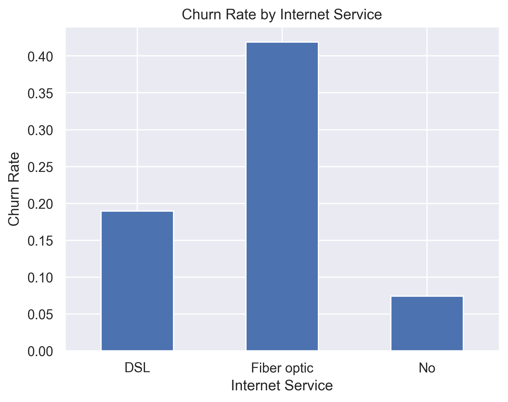

### Churn Rate by Tech Support

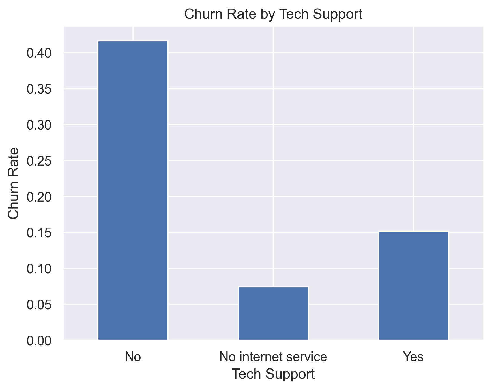

### Monthly Charges by Churn

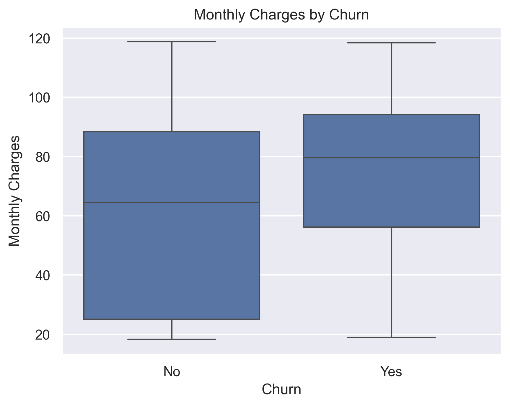

### Tenure vs Monthly Charges

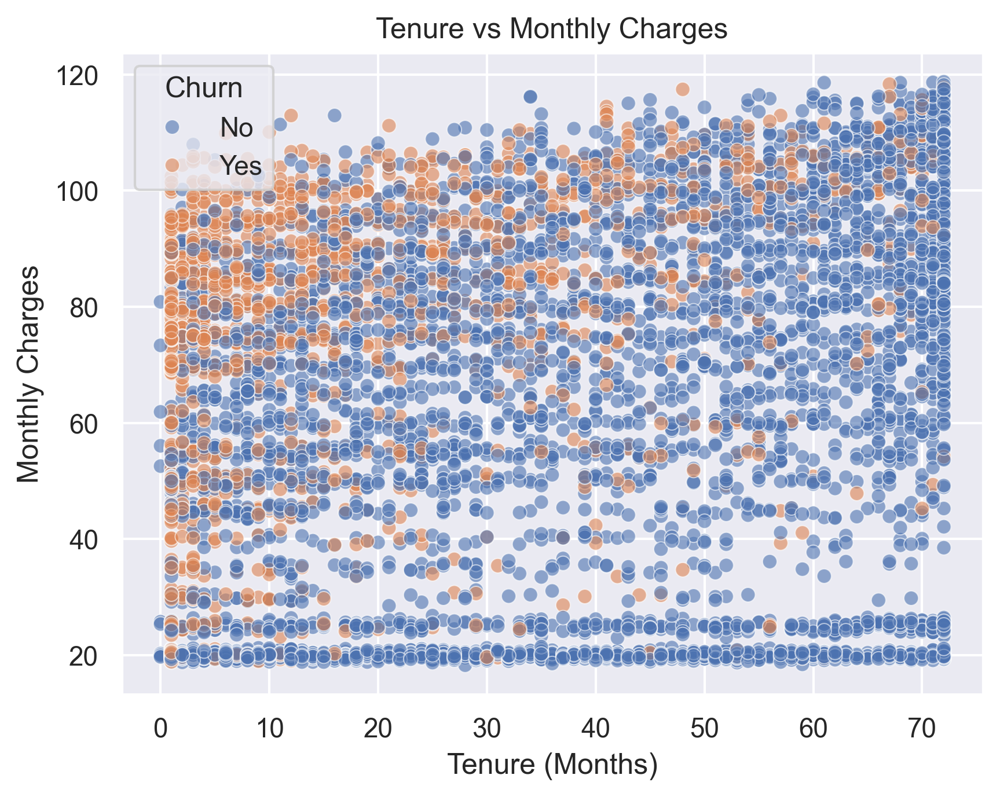

## Feature Engineering

The new features were kept fairly simple and were based on columns already in the dataset.

| Feature                    | What it represents                                         |
| -------------------------- | ---------------------------------------------------------- |
| `tenure_group`             | Customer tenure grouped into ranges                        |
| `avg_monthly_spend`        | Average historical monthly charge over the recorded tenure |
| `service_count`            | Number of subscribed services                              |
| `security_support_count`   | Number of security and support services                    |
| `streaming_services_count` | Number of streaming services                               |
| `is_month_to_month`        | Whether the customer has a month-to-month contract         |

## Modeling

Two baseline classification models were trained and compared:

- Logistic Regression
- Random Forest

The data was split into training and test sets using stratification. Preprocessing was kept inside the model pipelines so that it was fitted only on the training data during cross-validation.

Five-fold stratified cross-validation was used to compare the models.

The models were evaluated using precision, recall, F1-score, and ROC-AUC.

### Cross-Validation Results

| Model               | Precision | Recall |     F1 | ROC-AUC |
| ------------------- | --------: | -----: | -----: | ------: |
| Logistic Regression |    0.6664 | 0.5365 | 0.5938 |  0.8460 |
| Random Forest       |    0.6377 | 0.4870 | 0.5519 |  0.8269 |

### Test Set Results

| Model               | Precision | Recall |     F1 | ROC-AUC |
| ------------------- | --------: | -----: | -----: | ------: |
| Logistic Regression |    0.6532 | 0.5187 | 0.5782 |  0.8421 |
| Random Forest       |    0.6109 | 0.4786 | 0.5367 |  0.8203 |

Logistic Regression performed better than Random Forest across all four metrics on the test set. It was therefore the stronger baseline model for this project.

The models were kept as baseline models, so no extensive hyperparameter tuning was done.

## Top 3 Recommendations

### 1. Encourage Longer Contracts

Month-to-month customers showed much higher churn. The company should test incentives that encourage customers to move to longer-term contracts.

### 2. Improve the First-Year Customer Experience

Customers with shorter tenure showed higher churn. Better onboarding and early customer support could help reduce cancellations.

### 3. Review High-Risk Service Groups

Fiber optic customers and customers without TechSupport showed higher churn rates. These groups should be monitored more closely and tested with targeted support or retention offers.

## Adaptive Project — Handling Imbalanced Data & Driving Retention Decisions

The original Telco Customer Churn project established the data audit, cleaning, EDA, feature engineering, and baseline classification workflow.

The adaptive phase builds on that work and focuses on improving churn prediction for the imbalanced target and turning the model into a more useful retention decision tool.

### Part 01 — Strengthen Churn Analysis

✅ Complete

This stage revisited the churn distribution, class imbalance, important churn patterns, and data quality issues before advanced model development.

The dataset contains 7,043 customers and the churn rate is approximately 26.54%.

A model that predicts every customer as `No Churn` would achieve approximately 73.46% accuracy while detecting no churned customers. This demonstrates why accuracy alone is not suitable for this problem.

The strongest churn differences were found across contract type and tenure. Month-to-month customers had a churn rate of approximately 42.71%, while two-year customers had a churn rate of approximately 2.83%.

Customers with 0-12 months of tenure had a churn rate of approximately 47.44%, compared with approximately 9.51% for customers with 49-72 months of tenure.

The `TotalCharges` issue was also confirmed. The raw column contains 11 blank values that cannot be converted to numeric values. These records have zero tenure and will continue to be handled through the existing preprocessing pipeline.

The new phase will use these findings to guide class imbalance handling, model comparison, threshold tuning, and retention decisions.

### Part 01 Visualizations

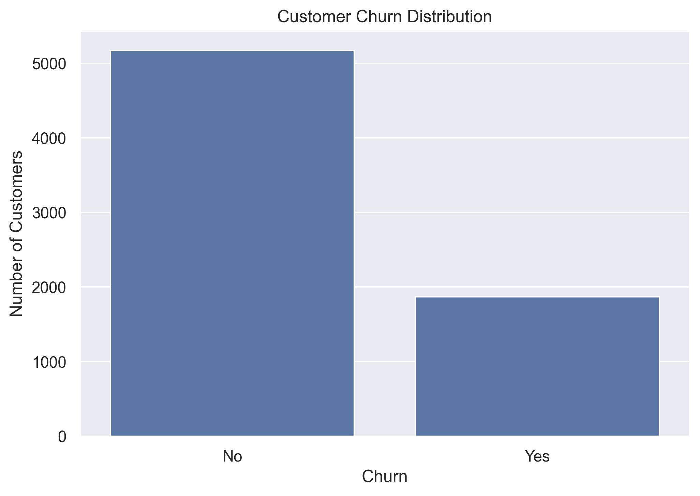

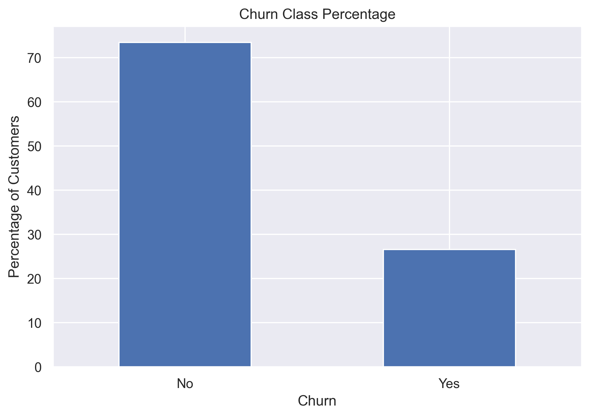

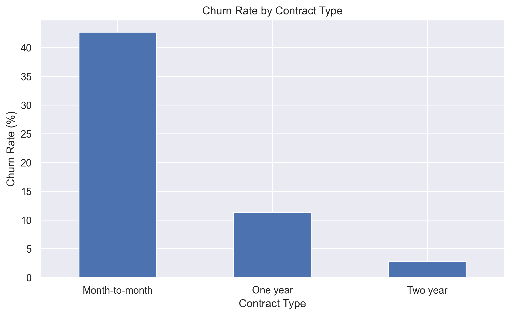

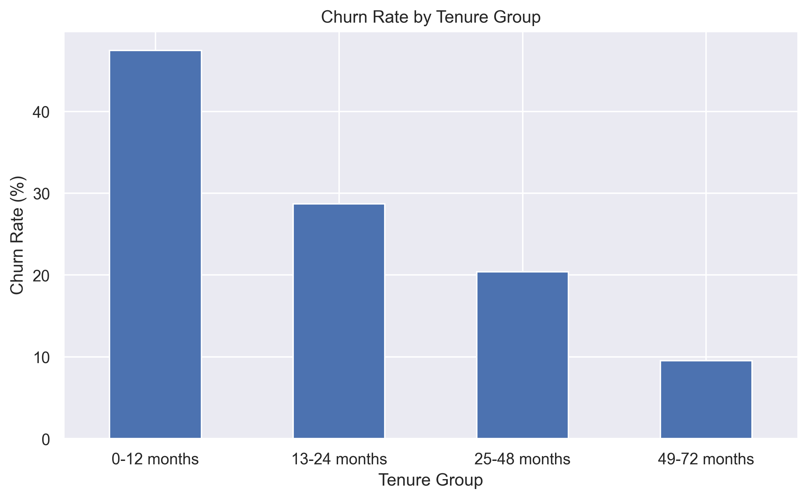

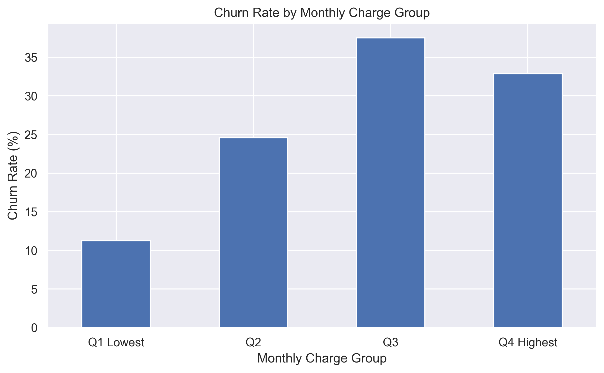

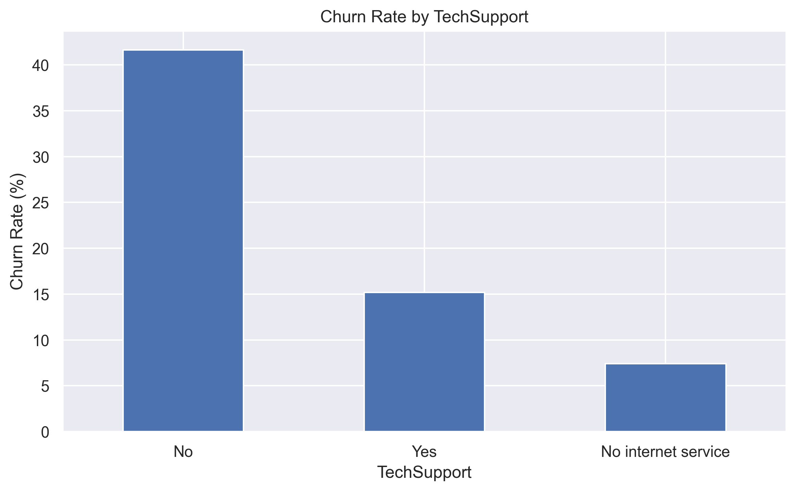

## Project Status

The main stages of the project are complete:

- Data audit
- Data cleaning and preprocessing
- EDA
- Feature engineering
- Baseline model training
- Model evaluation
- Business recommendations
- Project documentation

Now, the adaptive churn prediction phase is now in progress.

## Project Structure

```text
telco-customer-churn/
│
├── dataset/
│   └── telco_customer_churn.csv
│
├── images/
│   ├── 1_customer_churn.png
│   ├── 2_customer_tenure.png
│   ├── 3_monthly_charges.png
│   ├── 4_total_charges.png
│   ├── 5_contract_type.png
│   ├── 6_churn_by_contract_type.png
│   ├── 7_churn_rate_by_contract_type.png
│   ├── 8_churn_rate_by_tenure_group.png
│   ├── 9_churn_rate_by_internet_service.png
│   ├── 10_churn_rate_by_tech_support.png
│   ├── 11_monthly_charges_by_churn.png
│   ├── 12_tenure_vs_monthly_charges.png
│   ├── 13_churn_class_imbalance.png
│   ├── 14_churn_class_percentage.png
│   ├── 15_churn_rate_by_contract_phase2.png
│   ├── 16_churn_rate_by_tenure_phase2.png
│   ├── 17_churn_rate_by_monthly_charge.png
│   └── 18_churn_rate_by_tech_support_phase2.png
│
├── README.md
├── requirements.txt
├── SUMMARY.md
└── Telco_Churn.ipynb
```

The repository contains the files used for the completed analysis.

## Tools

The project uses Python, Pandas, NumPy, Matplotlib, Seaborn, scikit-learn, and Jupyter.

## Dataset Note

The raw dataset is kept in its original form. Cleaning, preprocessing, feature engineering, and modeling are done in the notebook using a working copy of the data.
